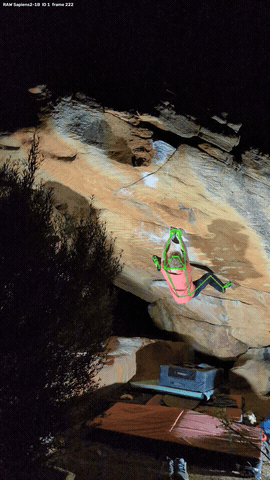

# ClimbTrack

An offline pipeline that turns a climbing video into precise, temporally stable 2D skeleton data,
splits the ascent into individual moves, and measures how fast and how well coordinated each move
was. Everything runs locally: no video ever leaves the machine.



## What ClimbTrack does

Imagine filming someone climbing a boulder problem on your phone. You can watch the video back, but
you cannot really say *why* one attempt worked and another did not.

ClimbTrack takes that video apart, frame by frame:

1. **It finds the climber.** Other people in the gym are detected too, then filtered out — the tool
   follows one person through the whole video.
2. **It marks the body.** In every single frame it places 308 points on the body: joints, fingers,
   toes. Drawn over the video, this becomes the moving stick figure you see above.
3. **It splits the climb into moves.** A "move" here means one hand letting go of a hold and
   grabbing the next one. The tool finds those automatically by looking for a hand that was still,
   moves, and becomes still again somewhere else.
4. **It measures each move.** How long it took, how far the hand travelled, how fast it went at its
   quickest point, how much the hips rose, and whether the body started moving before the hand did —
   which is roughly the difference between pulling yourself up with your arms and driving the move
   from your legs.

The result is a browser view where you can step through the climb move by move, with a speed curve
running alongside the video, and correct any boundary the automatic detection got wrong.


**What it does not do:** it does not tell you whether a move was *good*. It measures, you interpret.
It also cannot see holds, cannot measure force, and works in 2D — so numbers from two different
camera angles are not directly comparable.

## Requirements

- Python 3.12, managed by [uv](https://docs.astral.sh/uv/)
- `ffmpeg` and `ffprobe`
- macOS on Apple Silicon is the tested platform; other platforms work with a suitable device setting
- Disk space: roughly **0.4 GB per second of 4K footage**, plus 5.8 GB for the models

## Quickstart

```bash
git clone <repository-url>
cd climbtrack

brew install ffmpeg          # or your platform's package manager
uv sync --locked
```

Download the models. This never happens automatically — review the terms in [NOTICE.md](NOTICE.md)
first, because the pose weights and the detector carry their own licenses:

```bash
uv run climbtrack download-yolo -c configs/default.yaml
uv run climbtrack download-sapiens -c configs/default.yaml
```

Verify the installation. This checks the compute device, both binaries, and the size and SHA-256 of
both models. A missing model or unavailable device is a hard error — there is no silent fallback to
CPU or to a different model:

```bash
uv run climbtrack preflight -c configs/default.yaml
```

## Analyzing a new video

One command does everything and opens the result:

```bash
uv run climbtrack player "/path/to/your-video.mp4" -c configs/default.yaml
```

It runs ingest → detection → tracking → climber selection → pose → refinement → move detection →
skeleton rendering → browser proxy, then serves a player on `127.0.0.1`. Anything already cached is
reused, so a second run on the same video starts in seconds.

What to expect along the way:

1. **Time and space.** The pose stage dominates: hours for a long video, and lossless input frames
   are the bulk of the disk usage. Press `Ctrl+C` to stop and re-run the *same* command to resume —
   completed frames are skipped. Do not pass `--force` for a normal resume; it rebuilds the stage on
   purpose and moves the previous result into a recoverable backup.
2. **If the climber is ambiguous.** Selection scores track length, continuity, vertical movement,
   general motion, position, and image area. When the top two candidates are too close, the run
   stops instead of guessing. Render every track ID, then pick one:

   ```bash
   uv run climbtrack render-tracks "/path/to/video.mp4" --review-all -c configs/default.yaml
   uv run climbtrack player "/path/to/video.mp4" --track-id 7 -c configs/default.yaml
   ```

   `--click` lets you click the right box in a local desktop session instead.
3. **If the video is HDR.** Phone recordings often are, and ingest refuses them by default rather
   than quietly clipping highlights. Set `ingest.hdr_policy` to `tonemap` or `clip` in your config.
4. **If no moves are found.** Short clips may yield no candidates, because detection requires stable
   phases before and after the movement. The player still opens with an empty list — set the
   boundaries by hand under **Edit boundaries**.
5. **Correcting boundaries.** Select a move, then either press `Use current frame` or type the frame
   number directly. Changes save immediately to `annotations/<video-session>/`. **Restart the player
   afterwards** so the metrics are recomputed for the new boundaries; until then it shows
   *"Restart the player to recalculate"*.

Individual stages can also be run on their own — `ingest`, `detect`, `track`, `select`, `pose`,
`refine`, `render-pose`, `detect-moves`, `measure-moves` — and each pulls its prerequisites from the
cache. `climbtrack --help` lists all of them. Unlike the player, `detect-moves` and `measure-moves`
fail loudly, because there the result itself is the goal.

## How it works

```text
Video
  │
  ▼
00_ingest ──► frames + true source timestamps + metadata
  │
  ▼
10_detect ──► person boxes from YOLO11x
  │
  ▼
20_track ───► stable person IDs from ByteTrack
  │
  ▼
25_select ──► exactly one climber + stabilised 3:4 pose crop
  │
  ▼
30_pose ────► 308 raw Sapiens2 keypoints per frame
  │
  ├─────────► raw overlay video for visual review
  │
  ▼
40_refine ──► repaired and temporally stabilised keypoints
  │
  ├─────────► raw-vs-refined comparison video
  │
  ▼
70_moves ───► automatic move candidates
  │
  ▼
80_move_metrics ──► speed, posture, and coordination per move
  │
  ▼
90_player_video ──► browser-friendly proxy for the local player
```

Each stage writes into a content-addressed cache keyed by video, config, implementation, models, and
upstream artefacts. Change a render setting and the pose stays valid; change a pose setting and a new
entry is created on purpose. See [docs/data-formats.md](docs/data-formats.md).

All neural models run locally on the configured device (`mps` by default). An internet connection is
needed only for the explicit, one-time model download.

## Accuracy

Measured on a private reference video of 1,648 frames: ten deliberately difficult frames with 40
movement-relevant points each were corrected by hand, of which 394 points were visible and usable.

| Metric | Raw | After refinement |
|---|---:|---:|
| Mean error | 8.00 px | 3.31 px |
| PCK@0.2 | 98.98 % | 100.00 % |
| OKS-like score | 0.9859 | 0.9938 |
| 95th error percentile | 12.22 px | 11.50 px |
| Right-hand error | 61.94 px | 18.37 px |

Body, extra joints, and feet were already at 100 % PCK. The left hand became slightly worse on
average (7.30 → 9.56 px) while staying at 100 % PCK; the large right-hand improvement outweighs it.

**These numbers cannot be reproduced from this repository.** The reference video is private and not
included, and ten stress frames are a useful guardrail rather than proof for any given video. The
ground-truth annotations are versioned under `annotations/` so the evaluation itself is inspectable.

## Configuration

Everything lives in [configs/default.yaml](configs/default.yaml). Unknown keys are rejected rather
than ignored, so a typo cannot silently change results. For experiments, copy the file and pass your
own via `--config` instead of editing Python.

Model identity is pinned deliberately — repository revision, file size, and SHA-256 for both models.
That is the pinning that matters here, because it is what makes *results* reproducible. Python
dependencies are declared as compatible ranges and pinned exactly in the committed `uv.lock`.

## Project layout

```text
configs/                    YAML configuration
docs/                       data format reference and README media
src/climbtrack/
├── annotation/             stress-frame selection, editor, evaluation
├── backends/               YOLO11x, ByteTrack, Sapiens2 adapters
├── cache/                  manifests, atomic storage, upstream fingerprints
├── cli/                    Typer commands, grouped by purpose
├── model_downloads/        explicit, verified model downloads
├── moves/                  automatic move detection and correctable ground truth
├── player/                 local browser player, API, static front end
├── refinement/             One-Euro filter and temporal repair logic
├── rendering/              shared pose drawing and VFR-safe video output
├── schema/                 canonical parquet and keypoint schemas
├── selection/              climber scoring, click selection, pose crops
├── stages/                 the pipeline stages themselves
├── video/                  ffprobe and deterministic frame decoding
├── config.py               strict configuration models
├── pipeline.py             stage orchestration, independent of the CLI
└── provenance.py           reproducible provenance records
tests/
├── unit/                   pure logic
└── integration/            small synthetic video ingest
annotations/                small, versioned ground-truth sets
cache/                      large reproducible results; not in git
models/                     large model weights; not in git
```

The split keeps model adapters, orchestration, data schemas, rendering, and refinement logic apart.
There are no speculative abstraction layers for hypothetical backends, but the interfaces stay
extensible — a different pose backend can be mapped into the same canonical schema.

## Documentation

[docs/data-formats.md](docs/data-formats.md) covers the cache layout, the parquet schemas, and the
full configuration reference.

## License and notices

ClimbTrack is released under the [MIT License](LICENSE). The models it runs on are **not** included
and carry their own terms — in particular Sapiens2 (Meta) and YOLO11x (Ultralytics, AGPL-3.0). Read
[NOTICE.md](NOTICE.md) before using either beyond private experimentation.
